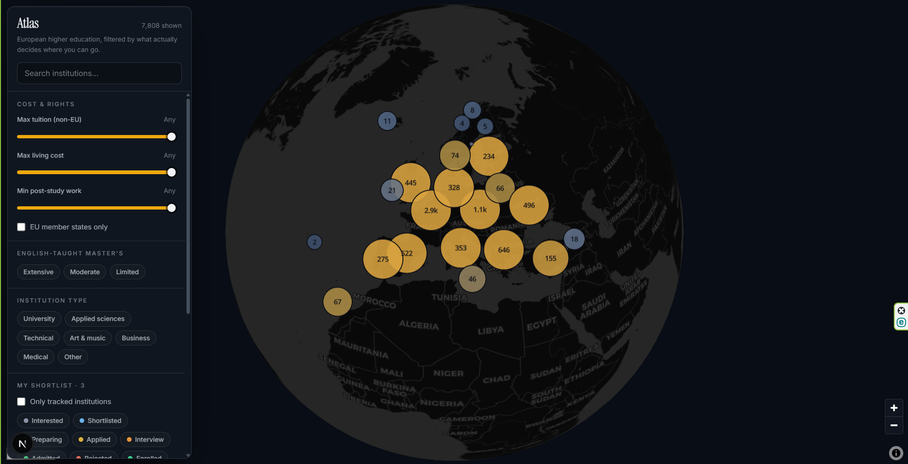
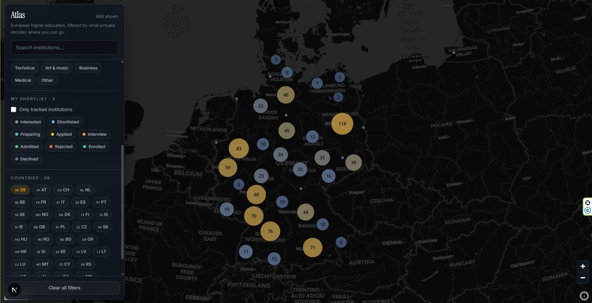
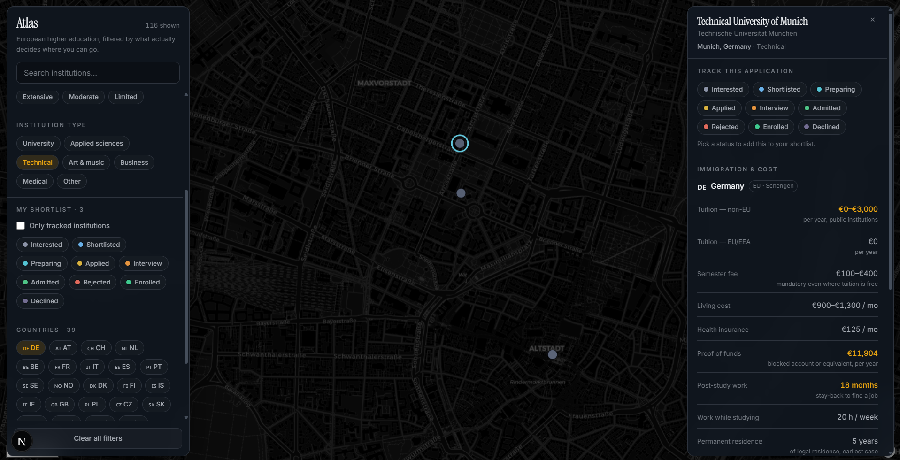

# Atlas — European universities & immigration

Interactive map of European higher-education institutions, filtered by the facts
that decide whether a place is realistically reachable: tuition for non-EU
students, living costs, proof-of-funds thresholds, post-study work rights, routes
to permanent residence, and how much is taught in English. A personal tracker
keeps your shortlist on the same map as the constraints.

Ranking sites tell you which universities are *good*. Almost none tell you which
ones you can *afford to enter and legally stay in afterwards*.

**Repo:** [ArmanBjr/universitis-atlas-europe](https://github.com/ArmanBjr/universitis-atlas-europe)



<p align="center">
  
  
</p>

<p align="center">
  
</p>

---

## Quick start

```bash
npm install
npm run setup          # creates data/app.db and loads data/universities.json
npm run dev            # http://localhost:3000
```

A seeded `data/universities.json` (~7.8k institutions, 39 countries) ships with
the repo. To refresh from Wikidata later (20–40 minutes):

```bash
npm run data:fetch                 # all countries
npm run data:fetch -- DE NL EE     # partial merge
npm run db:seed
```

---

## How it is put together

```
scripts/fetch-wikidata.ts   SPARQL → data/universities.json
scripts/seed.ts             JSON   → SQLite (data/app.db)

src/lib/countries.ts        hand-curated immigration & cost policy (39 countries)
src/lib/db/                 Drizzle schema, connection, queries
src/lib/filter.ts           pure client-side filtering
src/lib/store.ts            Zustand: points, filters, selection
src/app/api/                universities, detail, application status
src/components/             map canvas, filter panel, detail panel
```

**Why the split.** Institution records are machine-imported and re-fetchable.
Policy facts are not — they are hand-verified against official portals and carry a
`lastReviewed` date. Mixing the two would make the whole dataset uncitable, so
they live in separate places and are joined only at read time.

**Why filtering is client-side.** Dragging the tuition slider re-filters the full
point set on every frame. A round trip per frame would feel broken, so country
policy is a static module and `applyFilters` stays synchronous.

**Why MapLibre clustering.** The GeoJSON source clusters natively in a worker.
A second rendering layer would mean two coordinate systems for no gain at this
point count.

---

## Data provenance

| Layer | Source | Trust |
|---|---|---|
| Institutions | Wikidata SPARQL (`P31/P279*` under Q38723) | machine-imported, re-fetchable |
| Immigration & cost policy | official ministry / immigration portals | hand-verified, dated `lastReviewed` |
| Application status & notes | you (local SQLite) | never overwritten by an import |

### Known limits of the institution data

- **Coordinates are tiered.** Most Wikidata entries have no `P625` of their own, so
  the importer falls back to headquarters (`P159`) then administrative city
  (`P131`). Each record carries `coordPrecision`; city-derived pins get a small
  deterministic offset so co-located institutions do not stack.
- **Institution type is inferred from the name** (multilingual stems). A German
  *Hochschule* with no other signal falls through to "Other".
- **Coverage follows Wikidata**, which is uneven across countries.
- **A handful of secondary schools still get through.** Subtree exclusions and a
  name denylist remove most of them; a few survive because the same English words
  mean tertiary education elsewhere (e.g. Serbian *visoka škola*).
- **Oxford/Cambridge colleges** appear as separate dots (separate Wikidata items).
- **Multi-campus institutions** keep one row; country is settled from the pin
  coordinate so tuition/visa figures match where the pin actually is.

### Known limits of the policy data

Every number in `src/lib/countries.ts` carries a `lastReviewed` date. Immigration
rules change without notice. **Confirm against the official portal before you act
on anything here.** Treat this app as a way to narrow thirty-nine countries down
to a shortlist, not as legal advice.

---

## The Wikidata importer

Workarounds are documented at the top of `scripts/fetch-wikidata.ts`. In short:

1. Country QIDs are pinned (ISO lookup returns the wrong entity for NL and others).
2. The 604-class tree under Q38723 is materialised once, then used as a flat `VALUES` list.
3. Hydration is batched (`GROUP BY` + `SAMPLE`) to avoid cartesian explosions.
4. Police / military / faculty / secondary-school subtrees are excluded.
5. A name denylist catches residue no subtree can reach (e.g. Italian licei).
6. One row per Wikidata ID; country is inferred from coordinates for multi-`P17` items.

`npm run data:verify` guards the exclusion list so you cannot accidentally empty
the import or cut conservatories / grandes écoles.

---

## Scripts

| Command | What it does |
|---|---|
| `npm run dev` | dev server on :3000 |
| `npm run build` / `start` | production build and serve |
| `npm run typecheck` | `tsc --noEmit` |
| `npm run lint` | ESLint |
| `npm run data:fetch` | Wikidata → `data/universities.json` |
| `npm run data:verify` | check class exclusions |
| `npm run data:diagnose` | per-class counts for one country |
| `npm run db:push` | apply Drizzle schema to `data/app.db` |
| `npm run db:seed` | JSON → SQLite (preserves applications) |
| `npm run db:studio` | Drizzle Studio |
| `npm run setup` | `db:push` then `db:seed` |

Re-seeding upserts institutions and leaves your applications/notes alone.

---

## Using it

- **Click a dot** for the institution, its country's rules, and the status picker.
- **Click a cluster** to drill into it.
- **Statuses:** interested → shortlisted → preparing → applied → interview →
  admitted/rejected → enrolled/declined. Click the active status again to clear.
- **Notes autosave** (no save button).
- **Sliders** sit at "Any" at the top of their track. Cost filters use the *top*
  of each country's band.
- **Esc** closes the detail panel.

---

## Stack

Next.js 16 (App Router) · React 19 · TypeScript · Tailwind v4 · MapLibre GL 6 ·
Drizzle ORM + better-sqlite3 · Zustand.

Basemap: CARTO dark-matter raster tiles (free, no API key).

---

## Licence and attribution

Institution data from [Wikidata](https://www.wikidata.org) under
[CC0](https://creativecommons.org/publicdomain/zero/1.0/). Basemap © CARTO,
data © OpenStreetMap contributors. Policy figures compiled from official
government sources; see `lastReviewed` on each country profile.
